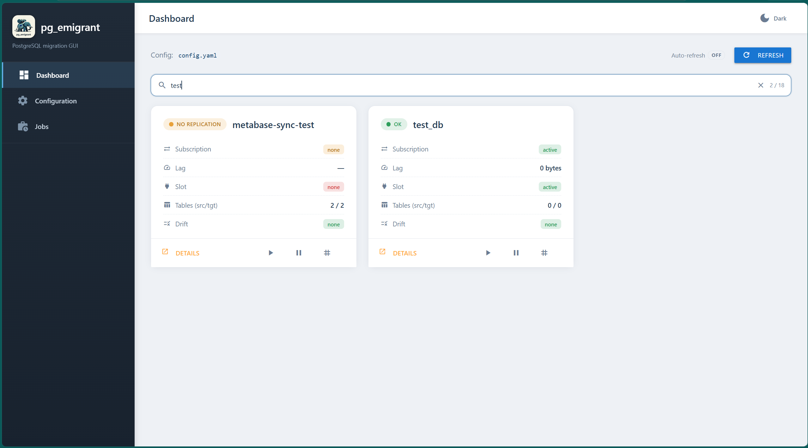

# pg_emigrant

**A PostgreSQL migration & logical-replication orchestrator.**

pg_emigrant performs a complete, low-downtime migration of one or many PostgreSQL
databases from a *source* server to a *target* server. It builds on PostgreSQL's
native **logical replication** and fills in everything that native replication
leaves out: a fast parallel initial data copy, full schema reproduction (types,
functions, triggers, views, ownership, …), continuous **sequence synchronisation**,
**DDL drift** detection/repair, and automatic recovery after a **Patroni
switchover/failover**.

Everything is driven from a single `pg_emigrant` CLI and one YAML config file.

> **Prefer a browser?** pg_emigrant also ships an optional **web GUI** — a Material
> Design dashboard to configure-view and monitor your migrations without leaving the
> browser. It's a thin layer over the very same orchestration the CLI uses. See
> [Web GUI](#web-gui) to get started.

<p align="left">
  
</p>

---

## Table of contents

- [Concepts & how it works](#concepts--how-it-works)
- [What gets migrated](#what-gets-migrated)
- [The bootstrap pipeline (step by step)](#the-bootstrap-pipeline-step-by-step)
- [Requirements](#requirements)
- [Installation](#installation)
- [Configuration](#configuration)
- [CLI reference](#cli-reference)
  - [`bootstrap`](#pg_emigrant-bootstrap)
  - [`start` / `stop`](#pg_emigrant-start--pg_emigrant-stop)
  - [`teardown`](#pg_emigrant-teardown)
  - [`status`](#pg_emigrant-status)
  - [`sync-sequences`](#pg_emigrant-sync-sequences)
  - [`detect-ddl`](#pg_emigrant-detect-ddl)
  - [`reinit-sync`](#pg_emigrant-reinit-sync)
- [Output formats](#output-formats)
- [Web GUI](#web-gui)
- [New tables created after bootstrap](#new-tables-created-after-bootstrap)
- [Special handling & edge cases](#special-handling--edge-cases)
- [Typical migration workflow](#typical-migration-workflow)
- [Limitations](#limitations)
- [Project layout](#project-layout)
- [Module reference](#module-reference)
- [Security](#security)
- [License](#license)

---

## Concepts & how it works

A migration with pg_emigrant has two phases.

**1. Bootstrap (one-shot).** `pg_emigrant bootstrap` reproduces the schema on the
target, copies all existing rows with parallel `COPY`, then creates a PostgreSQL
**publication** on the source and a **subscription** on the target. From that
moment on, all new `INSERT` / `UPDATE` / `DELETE` / `TRUNCATE` on the source flow
to the target over the WAL stream automatically.

**2. Steady state (until cutover).** While the application keeps writing to the
source, you run `pg_emigrant sync-sequences --loop` to keep sequence values in
step (logical replication does **not** replicate sequence advances) — this same
process also picks up **tables created on the source after bootstrap**
automatically (publication membership, target-side table creation, subscription
refresh — no separate command needed, see [below](#new-tables-created-after-bootstrap)),
use `pg_emigrant status` to watch lag, and optionally `pg_emigrant detect-ddl` to
catch and repair other schema changes (columns, indexes, functions, …) made on
the source after bootstrap. If the source is a Patroni cluster and a
failover/switchover happens, `pg_emigrant reinit-sync` repairs the broken
slot/subscription without re-copying data.

At cutover you stop replication, run a final sequence sync, point the application
at the target, and (optionally) tear the replication objects down.

Each database is handled **independently** and gets its own publication,
subscription and replication slot (PostgreSQL logical replication is scoped to a
single database — there is no way around that).

---

## What gets migrated

During bootstrap (and re-checked by `detect-ddl`) pg_emigrant reproduces, in
dependency order:

| Object | How it is handled |
|---|---|
| **Database** | `CREATE DATABASE … TEMPLATE template0` with the source's `ENCODING`, `LC_COLLATE`/`LC_CTYPE` (or `LOCALE_PROVIDER icu` + `ICU_LOCALE` on PG15+ ICU-provider databases) — not the target cluster's defaults, since a locale mismatch silently changes sort order for `ORDER BY`, index range scans, and text comparisons on non-ASCII data. Falls back to the target's own defaults (with a loud warning) if the target OS doesn't have that locale installed. |
| **Schemas** | `CREATE SCHEMA IF NOT EXISTS` for every non-system schema. |
| **Extensions** | Every extension on the source except `plpgsql` is installed on the target with `CREATE EXTENSION IF NOT EXISTS … WITH SCHEMA` **before** tables/indexes (so operator classes like `pg_trgm`, `btree_gin` exist when indexes are built), into the *same* schema as the source rather than always landing in `public`. That schema is pre-created if needed — except for extensions that auto-create their own schema via a `_PG_init` hook, which is detected and handled specially (see [Special handling](#special-handling--edge-cases)). |
| **Collations** | User-defined `CREATE COLLATION` objects (libc / ICU / builtin provider, including `DETERMINISTIC = false`) are created **before** types and tables, and every column/domain/range `COLLATE` reference to a non-`pg_catalog` collation is schema-qualified. |
| **Enum types** | Created with their labels in source order (labels are properly literal-escaped — one containing `'` is fine); if the type already exists, missing labels are appended with `ALTER TYPE … ADD VALUE IF NOT EXISTS`. |
| **Composite (row) types** | Created with all attributes; retried up to 3× to resolve type-on-type dependencies. |
| **Domains** | `CREATE DOMAIN … AS <base type> [COLLATE …] [DEFAULT …] [NOT NULL] [CONSTRAINT … CHECK (…)]`, retried up to 3× (a domain's base type may itself be a domain or composite type). |
| **Range types** | `CREATE TYPE … AS RANGE (SUBTYPE = …, …)`, including `COLLATION`, `CANONICAL` and `SUBTYPE_DIFF` when set; `SUBTYPE_OPCLASS` is not reproduced (the subtype's default operator class is used — rarely customised in practice). |
| **User-defined aggregates** | `CREATE AGGREGATE` hand-built from `pg_aggregate` (`pg_get_functiondef` doesn't support aggregates): `SFUNC`/`STYPE`/`FINALFUNC`/`COMBINEFUNC`/`SERIALFUNC`/`DESERIALFUNC`/`INITCOND`, the moving-aggregate (`M…`) variants, and `PARALLEL`. Ordered-set / hypothetical-set aggregates (`WITHIN GROUP`) use different syntax that isn't reproduced — reported with a warning instead of emitting broken DDL. `SORTOP` is not reproduced. |
| **Sequences** | Re-created with the source's `INCREMENT / MINVALUE / MAXVALUE / START / CACHE / CYCLE`, then `setval()` to the source's current value. Identity-backed sequences are **not** pre-created (the table's identity column creates them — pre-creating the name would make PostgreSQL silently attach a phantom `…_seq1` to the column); their values are applied by a final sequence pass at the end of bootstrap. |
| **Tables & columns** | `CREATE TABLE` reproducing every column's type, `COLLATE` (only when it differs from the type's default — the common case is left implicit, matching pg_dump), `NOT NULL`, and `DEFAULT`. Existing tables get any missing columns added. |
| **Identity columns** | `GENERATED ALWAYS AS IDENTITY` / `GENERATED BY DEFAULT AS IDENTITY` preserved exactly, **including the identity sequence's own parameters** (`INCREMENT BY / MINVALUE / MAXVALUE / START WITH / CACHE / CYCLE`) — omitting them would silently reset e.g. `INCREMENT BY 5` to 1 on the target, a collision generator for multi-writer id schemes. |
| **Serial / `nextval()` defaults** | Kept as the original `DEFAULT nextval('…')` against the explicitly pre-created named sequence — deliberately **not** converted to identity, which would make PostgreSQL spawn a phantom `…_seq1` sequence that sequence-sync would never update. |
| **Stored generated columns** | `GENERATED ALWAYS AS (expr) STORED` reproduced faithfully. |
| **Primary keys, UNIQUE & CHECK constraints** | Created during the schema phase (before data copy). |
| **Foreign keys** | Created **after** the data copy so PostgreSQL validates referential integrity across the fully-loaded dataset. |
| **Indexes** | PK/UNIQUE indexes created before copy; all other (non-unique) indexes created **after** copy (one sequential build instead of row-by-row maintenance). Materialized view indexes are created after that matview is refreshed (see below). |
| **Functions & procedures** | `CREATE OR REPLACE` from `pg_get_functiondef`, created with `check_function_bodies = off` (as pg_dump does) so a function never fails just because a table/view it references doesn't exist yet; attempted before tables (for generated-column/DEFAULT expressions), again after tables, and a final pass after views. Auto-generated companion functions (e.g. a range type's constructor) are skipped — they're created automatically by the object that owns them. |
| **Triggers** | All non-internal triggers re-created **last**, after tables, functions *and* views exist (`DROP TRIGGER IF EXISTS` first, since triggers have no `CREATE OR REPLACE`). The source's **ENABLE state** (`DISABLED` / `ENABLE REPLICA` / `ENABLE ALWAYS` — never included in `pg_get_triggerdef`) is reproduced, so a trigger disabled on the source does not come back enabled on the target and fire unexpectedly at cutover. Clones on partition children (`tgparentid ≠ 0`) are skipped — creating the parent's trigger creates them automatically. |
| **Views** | `CREATE OR REPLACE VIEW`; retried up to 3× to resolve view-on-view chains. |
| **Materialized views** | Dropped and re-created `WITH NO DATA` when their definition changes, then **populated with `REFRESH MATERIALIZED VIEW`** and their indexes built (in that order — faster on already-loaded data than incremental maintenance). Refresh runs during bootstrap only, not on every `detect-ddl` check. |
| **Row-level security** | `ENABLE`/`FORCE ROW LEVEL SECURITY` and every `CREATE POLICY`, applied **after** the data copy — enabling `FORCE ROW LEVEL SECURITY` too early could silently block a non-superuser migration role's own bulk load. Existing policies are dropped and re-created on change (no `CREATE OR REPLACE POLICY`). |
| **`REPLICA IDENTITY FULL`** | Set on **both** source and target for tables that have no primary key, so logical replication can replicate their `UPDATE`/`DELETE`. Applied *before* the publication/slot are created — see [why the slot is created first](#why-the-slot-is-created-before-the-data-copy). |
| **Ownership** | `ALTER … OWNER TO` for tables, sequences, views, materialized views, user-defined types (enums, composites, domains, range types), functions, procedures, schemas, and the database itself. |
| **Privileges (`GRANT`)** | Every non-owner grant on tables, sequences, views, matviews, schemas (e.g. `USAGE`), functions/procedures (`EXECUTE`), types, `ALTER DEFAULT PRIVILEGES` entries, and the database itself — additive only, see [below](#special-handling--edge-cases). |
| **Per-database settings** | `ALTER DATABASE … SET` and `ALTER ROLE … IN DATABASE … SET` entries (`pg_db_role_setting`) — a per-database `search_path` being the classic case; logical replication never carries these and missing them only surfaces after cutover as runtime misbehaviour. List-valued GUCs (`search_path`, …) are emitted verbatim, scalar ones as literals. Role-scoped settings whose role is missing on the target are skipped with a warning. |
| **Row data** | Streamed with parallel, snapshot-consistent `COPY` (see below). |

Objects that PostgreSQL/extensions manage internally are deliberately skipped:
extension-owned objects (`pg_depend deptype = 'e'`), auto-generated companion
functions (`pg_depend deptype = 'i'`, e.g. a range type's constructor), and
**TimescaleDB continuous aggregates** (backed by internal hypertables and not
re-creatable with plain DDL).

---

## The bootstrap pipeline (step by step)

For every database, `bootstrap` runs the following ordered pipeline. Unlike a
pg_dump-style *pre-data → data → post-data* split, the replication slot is
created **before** the data copy, not after — see
[why the slot comes first](#why-the-slot-is-created-before-the-data-copy) below.

1. **Create the database on the target** if it does not already exist
   (`CREATE DATABASE`).
2. **Discover the schemas** to migrate (or use the explicit `schemas:` list).
3. **Pre-copy schema sync** (`sync_schemas`):
   extensions → ensure schemas exist → enum types → composite types → sequences
   (identity-backed sequences are skipped here, see below) → functions
   (best-effort pre-pass) → tables with **PK / UNIQUE / CHECK** constraints
   and **UNIQUE** indexes → functions (second best-effort pass).
   *Foreign keys, triggers, views and non-unique indexes are intentionally
   deferred.*
4. **`REPLICA IDENTITY FULL`** is set on PK-less tables, on **both** source and
   target, right after schema sync — before the publication or slot exist.
5. **Create the publication** on the source
   (`CREATE PUBLICATION … FOR TABLES IN SCHEMA …`).
6. **Create the replication slot** on the source up front, over a raw
   replication-protocol connection, exporting a snapshot consistent with the
   slot's exact starting LSN (`CREATE_REPLICATION_SLOT … LOGICAL pgoutput`).
7. **Parallel initial data copy** (`copy_all_tables`), using the slot's own
   exported snapshot: all target tables are `TRUNCATE … CASCADE`d and streamed
   concurrently via CSV `COPY` (details below).
   **If any table fails to copy, bootstrap aborts this database here** — the
   slot and publication it just created are dropped, and it exits non-zero —
   because logical replication only streams *new* changes and would never
   backfill the missing rows.
8. **Deferred index build**: every non-unique index is created now, after the data
   is in place.
9. **Post-copy constraints** (`sync_post_copy_constraints`):
   foreign keys (with `search_path` set so unqualified names resolve) →
   functions (best-effort) → views & materialized views → a final function
   pass → **triggers last** (so their functions already exist).  Objects that
   still fail are listed in a red summary at the end of the run.
10. **Ownership sync**: `ALTER … OWNER TO` for every object whose owner differs.
11. **Final sequence value sync**: identity-backed sequences exist only now that
    their tables were created, and every other sequence may have advanced on the
    source while data was being copied.
12. **Create the subscription** on the target, attached to the slot created in
    step 6 (`copy_data = false`, `create_slot = false`) — **not** a new one.

Progress is shown live with a Rich spinner; each table reports its copied row
count, and PK-less tables are flagged in yellow. Any unexpected failure at any
step aborts that database's bootstrap and — if no subscription ended up
depending on them — drops the slot/publication it created, so a re-run starts
from a clean slate; other databases in the same run are unaffected.

### Why the slot is created before the data copy

Creating the replication slot *after* the data copy (the naive, pg_dump-like
order) leaves a data-loss window: the copy's snapshot and the slot's start LSN
would be two different points in time, and any transaction committed on the
source in between is in neither the copy (already taken) nor the WAL stream
(starts later) — a silent, permanent loss. pg_emigrant closes this window by
creating the slot **first**, via `CREATE_REPLICATION_SLOT … LOGICAL pgoutput`
over a raw replication-protocol connection, and copying data with the
**snapshot that command exports** — making the copy and the start of WAL
streaming the exact same consistent point. (asyncpg cannot issue this command
itself — it does not implement the PostgreSQL replication protocol — so this
one step uses `psycopg2`, run in a worker thread.) The subscription is then
created pointing at that already-existing slot (`create_slot = false`)
instead of making PostgreSQL create a fresh one.

One consequence: `REPLICA IDENTITY FULL` for PK-less tables must be set on the
source **before** the slot exists too — it is evaluated at WAL-write time, not
at slot-creation time, so a PK-less table's `UPDATE`/`DELETE` decoded from a
slot created before that `ALTER TABLE` would carry no old-row identity and the
subscriber would reject it.

### How the parallel copy works

- **One consistent snapshot.** The snapshot comes from the replication slot's
  own `CREATE_REPLICATION_SLOT … EXPORT_SNAPSHOT` (see above), not a plain
  `pg_export_snapshot()`; every worker does `SET TRANSACTION SNAPSHOT` so all
  tables are copied at the same point in time — the same point the slot starts
  streaming from. The snapshot-holder connection stays open until every table
  finishes, then is released (this does not drop the slot).
- **Table-level parallelism.** Up to `parallel_workers` tables are copied at once
  (an `asyncio.Semaphore` bounds concurrency).
- **Intra-table parallelism.** For a large table, when `table_parallel_workers > 1`
  and the table has at least that many pages, it is split into **`ctid`
  page-range slices** that stream concurrently. The last slice is left unbounded
  so rows added since the last `ANALYZE` are not skipped.
- **Streaming, flat memory.** Data is piped source→target through a bounded
  `asyncio.Queue` (CSV format, for cross-version compatibility) — no table is ever
  buffered in RAM. If the producer fails mid-stream, the error is re-raised inside
  the consumer so PostgreSQL rolls the whole `COPY` back (no partial data).
- **Only matching columns.** Each table copies the **intersection** of source and
  target columns (preserving target order); generated columns are excluded.
- **Bulk-load mode.** `session_replication_role = 'replica'` is set on the target
  during copy so triggers and FK checks don't fire on the bulk insert.
- **Failure isolation.** A failed table is recorded (row count `-1`) and logged,
  and the remaining tables still finish their copy — but the affected database
  is then **aborted before replication setup** and the command exits non-zero.
  Logical replication cannot backfill the missing rows, so fix the cause and
  re-run bootstrap for that database.
- **Inheritance-safe.** Rows are read with `SELECT … FROM ONLY`, so a classic
  (non-declarative) `INHERITS` parent never duplicates its children's rows;
  the inheritance *link* itself is not recreated on the target and is warned
  about during schema sync.

---

## Requirements

- **Python 3.11+**
- **PostgreSQL 13+ source, 15+ recommended; any supported version as target.**
  On a 15+ source the publication uses `CREATE PUBLICATION … FOR TABLES IN
  SCHEMA`, which automatically includes tables created later in an
  already-published schema. On a 13/14 source that syntax doesn't exist, so
  pg_emigrant enumerates the current tables with `FOR TABLE` instead. Either
  way, **no manual action is needed for tables created after bootstrap** —
  see [New tables created after bootstrap](#new-tables-created-after-bootstrap).
  Version-dependent catalog differences (`daticulocale`/`datlocale`,
  `colliculocale`/`colllocale`, PG17's builtin locale provider, PG16+ view
  deparse changes) are handled automatically — verified end-to-end on a
  PG 14 → PG 18 migration.
- A migration role on each server with sufficient privileges:
  - **Source:** `REPLICATION` privilege — required for two things: creating the
    publication/replication slot (`CREATE_REPLICATION_SLOT`, issued directly by
    pg_emigrant *before* the data copy, not by the target), and letting the
    target's subscription connect to stream WAL. Read access to all migrated
    objects.
  - **Target:** ability to `CREATE DATABASE`, create schema objects, and
    `CREATE SUBSCRIPTION` (superuser, or the relevant privileges).
- **Source** `postgresql.conf`:
  ```ini
  wal_level = logical
  max_wal_senders     = 10   # ≥ number of databases replicated concurrently
  max_replication_slots = 10 # ≥ number of databases replicated concurrently

  # Strongly recommended: bound how much WAL a replication slot may retain,
  # so a stalled bootstrap or dead subscription cannot fill the source disk.
  # Size it generously — the slot created at the START of bootstrap retains
  # WAL through the whole copy + index/FK build, and if the limit trips the
  # slot is lost and that database must be re-bootstrapped.
  max_slot_wal_keep_size = 100GB
  ```
- **Target** `postgresql.conf`:
  ```ini
  max_logical_replication_workers = 10  # ≥ one apply worker per database
  max_worker_processes            = 10  # must cover the apply workers
  max_replication_slots           = 10  # ≥ one per subscription
  max_active_replication_origins  = 10  # ≥ one per database
  ```
- The source `pg_hba.conf` must allow a **replication** connection from the
  target host (otherwise `CREATE SUBSCRIPTION` hangs — see
  [subscription timeout](#robust-subscription-creation)).

---

## Installation

```bash
git clone https://github.com/kamilkroliszewski/pg_emigrant.git
cd pg_emigrant

python -m venv .venv
source .venv/bin/activate
pip install -e .
```

This installs the `pg_emigrant` console command:

```bash
pg_emigrant --help
```

Dependencies (from `pyproject.toml`): `asyncpg>=0.29`, `pydantic>=2.0`,
`pyyaml>=6.0`, `typer>=0.9`, `rich>=13.0`, `psycopg2-binary>=2.9`.

`psycopg2` is used for exactly one thing: opening a PostgreSQL
**replication-protocol** connection to run `CREATE_REPLICATION_SLOT …
EXPORT_SNAPSHOT` before the initial data copy (see
[why the slot is created first](#why-the-slot-is-created-before-the-data-copy)).
asyncpg does not implement that protocol, so this is the one place the tool
needs a second driver — every other operation still goes through asyncpg.

To also use the optional [web GUI](#web-gui), install the `web` extra (adds
`flask`):

```bash
pip install -e ".[web]"
```

---

## Configuration

Configuration is a single YAML file, validated by Pydantic. By default the CLI
looks for `config.yaml` in the current directory; override it on any command with
`--config / -c`.

```yaml
# Source server
source:
  host: db-source.internal
  port: 5432
  user: migrator
  password: secret
  dbname: postgres        # admin DB used for database auto-discovery
  sslmode: prefer

# Target server
target:
  host: db-target.internal
  port: 5432
  user: migrator
  password: secret
  dbname: postgres
  sslmode: prefer

# Schemas to replicate. Empty list = auto-discover every non-system schema,
# independently per database.
schemas: []

# Databases to migrate. Empty list = auto-discover all non-template databases
# (minus exclude_databases).
databases: []

# Databases skipped during auto-discovery.
exclude_databases:
  - template0
  - template1
  - postgres

# Object-name prefixes. The (sanitised) database name is appended to each, so
# database "myapp" → publication "pg_emigrant_pub_myapp",
# subscription/slot "pg_emigrant_sub_myapp".  Names are lower-cased and
# non-alphanumeric characters become "_"; when that sanitisation changes the
# name, a short hash suffix keeps otherwise-colliding databases ("my-app" vs
# "my_app") on distinct, valid slot names.
publication_name: pg_emigrant_pub
subscription_name: pg_emigrant_sub

# Parallelism.
parallel_workers: 4        # how many tables are copied at the same time
table_parallel_workers: 4  # ctid slices streamed concurrently per large table

# Sequence sync loop interval, in seconds.
sequence_sync_interval: 10
```

### Full parameter reference

| Key | Type | Default | Meaning |
|---|---|---|---|
| `source` | object | — | Source connection (`host`, `port`, `user`, `password`, `dbname`, `sslmode`). |
| `target` | object | — | Target connection (same fields). |
| `source/target.host` | str | `localhost` | Server host. |
| `source/target.port` | int | `5432` | Server port. |
| `source/target.user` | str | `postgres` | Login role. |
| `source/target.password` | str | `""` | Password (kept in memory only; never logged). |
| `source/target.dbname` | str | `postgres` | Admin/maintenance DB used for discovery and `CREATE DATABASE`. |
| `source/target.sslmode` | str | `prefer` | libpq SSL mode. |
| `schemas` | list[str] | `[]` | Schemas to replicate; empty = auto-discover per database. An explicit list is applied to **all** databases, and any source schema not in the list is logged as a skipped-schema **warning**. |
| `databases` | list[str] | `[]` | Databases to migrate; empty = auto-discover. |
| `exclude_databases` | list[str] | `[template0, template1, postgres]` | Skipped during database auto-discovery. |
| `publication_name` | str | `pg_emigrant_pub` | Publication name prefix; `_<dbname>` appended. |
| `subscription_name` | str | `pg_emigrant_sub` | Subscription **and** replication-slot name prefix; `_<dbname>` appended. |
| `parallel_workers` | int | `4` | Number of tables copied simultaneously. |
| `table_parallel_workers` | int | `4` | `ctid` page-range slices streamed concurrently for a single large table. |
| `sequence_sync_interval` | int | `10` | Seconds between iterations of `sync-sequences --loop`. |
| `exclude_tables` | list[str] | `[]` | **Accepted but currently has no effect** — table-level exclusion is not yet wired into the copy/publication path. |
| `replication_slot_name` | str | `pg_emigrant_slot` | **Accepted but unused** — the slot is named after the subscription (`subscription_name`_`<dbname>`), created automatically by PostgreSQL. |

> The last two keys are present in the config model (and in
> `config.yaml.example`) for forward-compatibility but are **not** consulted by
> the current code. They are documented here for completeness so their presence
> isn't mistaken for active behaviour.

### Auto-discovery rules

- **Databases:** every row in `pg_database` where `datistemplate = false`, minus
  `exclude_databases`. Provide an explicit `databases:` list to override.
- **Schemas:** every schema **except** the always-excluded set below. With an
  explicit `schemas:` list, that list wins (and uncovered source schemas are
  warned about).

Always-excluded schemas:

| Pattern | Why |
|---|---|
| `pg_catalog`, `information_schema`, `pg_toast` | PostgreSQL internals |
| `pg_temp_*`, `pg_toast_temp_*` | session-local temp objects |
| `_timescaledb_catalog`, `_timescaledb_config`, `_timescaledb_internal`, `_timescaledb_cache`, `timescaledb_information`, `timescaledb_experimental`, `toolkit_experimental` | TimescaleDB-managed, must not be hand-reproduced |
| `pg_anonymizer`, `anon` | PostgreSQL Anonymizer-managed |

---

## CLI reference

Global option (place **before** the command):

```
-v, --verbose    Enable DEBUG logging (default is INFO).
```

Every command accepts:

```
-c, --config PATH       Path to the config file (default: config.yaml).
-d, --database NAME      Operate on a single database instead of all discovered.
```

### `pg_emigrant bootstrap`

Runs the full one-shot migration pipeline described
[above](#the-bootstrap-pipeline-step-by-step) for every discovered database (or
just `--database`).

```bash
pg_emigrant bootstrap
pg_emigrant bootstrap --config /etc/pg_emigrant/prod.yaml
pg_emigrant bootstrap --database myapp
pg_emigrant --verbose bootstrap
```

### `pg_emigrant start` / `pg_emigrant stop`

Enable or disable (pause) the subscription apply workers. `stop` keeps the slot
and subscription intact — replication simply pauses; `start` resumes it.

```bash
pg_emigrant start                 # all databases
pg_emigrant stop                  # all databases
pg_emigrant start --database myapp
pg_emigrant stop  --database myapp
```

### `pg_emigrant teardown`

Drops the subscription on the target, the publication on the source, and the
replication slot on the source (terminating the slot's backend if necessary).

```bash
pg_emigrant teardown
pg_emigrant teardown --database myapp
```

> **Destructive & irreversible.** After teardown, resuming replication requires a
> fresh `bootstrap`.

### `pg_emigrant status`

A **read-only** dashboard for every database. It never writes to either server
(sequence comparison is read-only), so it is safe to run at any time — even
before bootstrap. Each section is collected independently; if one query fails
(e.g. the database isn't bootstrapped yet) the error is shown for that section
and the rest still render.

Sections:

| Section | Source of data | Shows |
|---|---|---|
| **Subscription** | `pg_stat_subscription` (target) | subscription name, worker PID, received/latest-end LSN, byte lag, last-message timestamps |
| **Slots** | `pg_replication_slots` (source) | slot name/type, active flag, active PID, restart LSN, confirmed-flush LSN, `wal_status` — warns loudly if no slot exists |
| **Lag** | `pg_stat_replication` (source) | application, state, sent LSN, write/flush/replay lag |
| **Tables** | `pg_class` both sides | per-schema table counts source vs target; mismatched rows highlighted yellow |
| **Sequences** | `pg_sequences` both sides | read-only value comparison (`ok` / `behind` / `target_ahead` / `missing_on_target`) |
| **Drift** | full drift scan | a one-line schema-drift summary |

With no section flags, **all** sections are shown. Pass one or more flags to
limit output (handy across many databases):

```
--subscription   --slots   --lag   --tables   --sequences   --drift
```

```bash
pg_emigrant status
pg_emigrant status --database myapp
pg_emigrant status --format simple --lag | grep write_lag
pg_emigrant status --format json --drift | jq '.[] | select(.drift.has_drift)'
pg_emigrant status --database myapp --tables --sequences
```

### `pg_emigrant sync-sequences`

Pushes sequence values **source → target**. This is the feature that prevents
primary-key collisions after cutover, because native logical replication never
replicates sequence advances. Values **only ever move forward** — the target is
never decreased.

Every invocation — one-pass or `--loop` — **also** reconciles tables created on
the source after bootstrap into replication, with no separate command; see
[New tables created after bootstrap](#new-tables-created-after-bootstrap).

```bash
pg_emigrant sync-sequences                       # one pass, all databases
pg_emigrant sync-sequences --database myapp       # one pass, one database
pg_emigrant sync-sequences --loop                 # run forever, every interval
pg_emigrant sync-sequences --database myapp --loop
pg_emigrant sync-sequences --database myapp --margin 1000  # final cutover sync
```

- **One-pass mode** prints a results table (rich/simple/json) and exits.
- **`--loop`** runs `sync_sequences_once` **and** `sync_new_tables` for every
  database concurrently, each on its own `sequence_sync_interval` cycle,
  forever (recommended during a live migration). Errors are logged and the
  loop continues.
- **`--margin N`** advances a sequence to `source_value + N` instead of exactly
  `source_value` — a safety buffer for the **last**, authoritative sync at
  cutover (see [Special handling](#special-handling--edge-cases)). Rejected
  together with `--loop`.

Per-sequence status values:

| Status | Meaning |
|---|---|
| `ok` | source and target already equal |
| `updated` | target advanced up to the source value |
| `target_ahead` | target already higher than source — left untouched (safe) |
| `orphaned_fixed` | sequence exists only on target; reset to `MAX(owning column) + 1` |
| `orphaned_unknown` | target-only sequence whose owning table couldn't be found — needs manual attention |
| `orphaned_error` | an error occurred while resolving a target-only sequence |
| `permission_denied` | the migration role lacks `SELECT`/`USAGE` on the sequence, so its real value cannot even be read (`pg_sequences.last_value` reads as NULL) — the sequence is **not** synced and is flagged red instead of being silently mistaken for a never-used sequence. Grant the privilege and re-run. |

> **Guard against premature sync.** If the target has *no* sequences in the
> relevant schemas (the database exists but hasn't been bootstrapped), the
> command exits without writing — so it never creates phantom sequences on a bare
> database.

### `pg_emigrant detect-ddl`

Compares the source and target schemas object-by-object and reports the drift.
Useful when the source schema keeps evolving during a long replication window
(DDL is never carried by the WAL stream).

```bash
pg_emigrant detect-ddl                       # report only
pg_emigrant detect-ddl --database myapp

pg_emigrant detect-ddl --apply               # apply fixes for fixable drift
pg_emigrant detect-ddl --apply --drop-extra  # also DROP target-only tables (destructive!)

pg_emigrant detect-ddl --format json > drift_$(date +%Y%m%d).json
```

Flags:

| Flag | Effect |
|---|---|
| `--apply` | Apply the generated fix DDL for `missing_on_target` and `different` items (including ownership). |
| `--drop-extra` | **Additionally** drop objects that exist on the target but not the source (`missing_on_source`). Destructive — prints a warning. |

What it checks (and the fix it proposes):

- **Schemas** missing on target → `CREATE SCHEMA`.
- **Tables** missing on target → full `CREATE TABLE` (+ constraints + indexes;
  schema creation prepended if needed). Missing on source → `DROP TABLE` (only
  applied with `--drop-extra`).
- **Columns** missing on target → `ADD COLUMN`; missing on source → reported;
  **type mismatches** → reported.
- **Indexes** (non-PK) missing on target → `CREATE INDEX`.
- **Constraints** missing on target → `ADD CONSTRAINT`.
- **Enum types** missing → `CREATE TYPE … AS ENUM`; missing labels →
  `ALTER TYPE … ADD VALUE`.
- **Functions / procedures** missing or body-different (matched per overload by
  signature) → `CREATE OR REPLACE`.
- **Triggers** missing or different → `DROP` + re-create.
- **Views / materialized views** missing or different → `CREATE OR REPLACE` /
  drop-and-recreate `WITH NO DATA`.
- **Ownership** mismatches for tables, sequences, views, materialized views,
  user-defined types, functions, procedures, schemas, and the database →
  `ALTER … OWNER TO`. If the source owner role does not exist on the target, the
  item is reported with an explanatory detail and an empty fix (create the role
  first).

When `--apply` creates new tables, the subscription is refreshed with
`copy_data = true` so PostgreSQL's built-in **tablesync** worker performs the
initial copy of the new table — avoiding the duplicate-key/WAL conflict a manual
copy would cause.

> TimescaleDB continuous aggregates are skipped (managed by the extension).

### `pg_emigrant reinit-sync`

Repairs replication after a **Patroni switchover/failover**, when the old slot or
subscription may have become stale or broken — **without re-copying data**. Safe
to run any time; it only touches what's missing or unhealthy.

Checks, in order:

1. **Publication** present on source → re-create if missing (schemas are
   re-discovered per database, exactly as bootstrap does).
2. **Replication slot** present and healthy on source (`wal_status != 'lost'`).
3. **Subscription** state on target:
   - slot healthy + subscription **disabled** → re-enable it;
   - slot healthy + enabled but **apply worker not running** → `REFRESH PUBLICATION`;
   - slot healthy but subscription **missing/broken** → drop the broken
     subscription (detaching it first so the slot survives) and create a new
     subscription **attached to the surviving slot** — replication resumes
     from the slot's confirmed LSN with **no data gap**. (A small overlap
     right at the boundary can surface as visible duplicate-key apply errors
     rather than silent loss; resolve with `ALTER SUBSCRIPTION … SKIP`.)
   - slot **missing or `lost`** (the usual outcome of a Patroni promotion —
     logical slots don't survive failover before PostgreSQL 17 failover
     slots) → drop what's left and create a fresh subscription with a fresh
     slot — and print a **loud `DATA-LOSS WINDOW` warning**: the new slot
     starts at the *current* LSN, so anything committed on the source between
     the old slot's last confirmed LSN and the reinit was never streamed and
     is permanently missing on the target. Verify affected tables (row
     counts / checksums) and re-copy them if needed before cutover. On
     PostgreSQL 17+ consider `sync_replication_slots = on` so a switchover
     no longer loses the slot in the first place.

```bash
pg_emigrant reinit-sync
pg_emigrant reinit-sync --database myapp
pg_emigrant reinit-sync --config /etc/pg_emigrant/prod.yaml
```

It reports, per database, the issues found (`⚠`), the actions taken (`✓`), or a
"healthy — nothing to do" line, and a final summary rule.

---

## Output formats

`status`, `sync-sequences`, and `detect-ddl` all accept `-f / --format`:

| Format | Description |
|---|---|
| `rich` *(default)* | Coloured, bordered tables for humans. |
| `simple` | One `key=value` record per line — easy to `grep`/`awk` across hundreds of databases. Values containing spaces/`=` are quoted. |
| `json` | A single JSON array (one object per database) printed to stdout — ideal for `jq`, CI artifacts, archiving. |

Example `simple` lines:

```
db=myapp section=lag application=pg_emigrant_sub_myapp state=streaming write_lag=0.0001 flush_lag=0.0002 replay_lag=0.0003
db=myapp section=table schema=public source=42 target=42 match=true
db=myapp section=sequence schema=public sequence=users_id_seq source=10053 target=9821 status=updated
db=myapp section=drift type=column schema=public table=users name=phone drift=missing_on_target detail="Column phone (text)"
```

---

## Web GUI

Besides the CLI, pg_emigrant ships an optional **web GUI** — a Material Design
dashboard (Flask + [Materialize CSS](https://materializecss.com/)) for people who
prefer to **configure-view and monitor** migrations from a browser. It is a thin
presentation layer: every page and action delegates to the **same async
orchestration functions the CLI uses** — no migration logic is duplicated.

Install the extra and launch it:

```bash
pip install -e ".[web]"
pg_emigrant web                       # http://127.0.0.1:8000, uses ./config.yaml
pg_emigrant web -c /etc/pg_emigrant/prod.yaml --port 9000
pg_emigrant web --host 0.0.0.0 --port 8000   # bind all interfaces (see security note)
```

Options: `-c/--config` (config file), `--host` (default `127.0.0.1`),
`-p/--port` (default `8000`), `--debug` (Flask reloader).

### What the GUI offers

| Page | What it does |
|---|---|
| **Dashboard** (`/`) | One auto-refreshing card per discovered database with a health pill (ok / warning / error) computed from subscription, slot activity, lag, table counts and drift. Quick `start` / `stop` / `sync-sequences` buttons per card. |
| **Database** (`/database/<db>`) | Full status sections — subscription, replication slots, lag, tables per schema, sequence sync, and a schema-drift table with proposed fix DDL — plus an **Actions** panel. |
| **Configuration** (`/config`) | **Read-only** view of the loaded `config.yaml`. Passwords are masked and never sent to the browser. Editing stays in the file / CLI. |
| **Jobs** (`/jobs`) | List of background jobs with live, per-job captured logs and tracebacks. |

### Actions & background jobs

Long-running or mutating operations (`bootstrap`, `teardown`, `start`, `stop`,
`sync-sequences`, `reinit-sync`, and `detect-ddl --apply` / `--drop-extra`) run as
**background jobs** off the request thread, so the browser stays responsive and
the UI streams progress. Destructive/long actions (bootstrap, teardown, apply)
require a confirmation in which you re-type the database name. Each job captures
the `pg_emigrant` log output produced by its own worker thread (concurrent jobs
don't mix), polled live into the **Jobs** page and a floating log panel.

> **Known limitation.** Decorative Rich progress output from `bootstrap` (the
> spinner and per-table row counts) goes to the **server's stdout**, not into a
> job's log buffer. The substantive orchestration messages use the standard
> `logging` module and *are* captured in the GUI.

### Styling is loaded from a CDN (internet access required)

> **Heads-up for offline / air-gapped environments.** The GUI's look &amp; feel —
> **Materialize CSS** and the **Material Icons** font — is pulled from a public CDN
> over HTTP(S) **by your browser** at page load (via the `<link>` / `<script>` tags
> in `pg_emigrant/web/templates/base.html`). The browser therefore needs outbound
> internet access for the page to render with styling.

What this does and does **not** affect:

- **No internet in the browser →** the GUI still *works* (all data, actions and
  jobs function normally — they go through the Flask app), but it renders
  **unstyled** (plain HTML, no Material Design layout or icons).
- **The application itself needs no internet.** pg_emigrant only talks to your
  source/target **PostgreSQL** servers; the CDN is purely cosmetic and is fetched
  by the browser, not by the server.

**To run fully offline,** vendor the assets locally: download
`materialize.min.css`, `materialize.min.js` and a Material Icons font into
`pg_emigrant/web/static/`, then point the three CDN tags in `base.html` at those
local files with `url_for('static', filename=…)`. No other code changes are
needed.

### Security

The GUI exposes the configuration and can trigger **destructive** database
operations. It therefore **binds to `127.0.0.1` by default and ships without
authentication**. Do **not** expose it on a public interface without putting a
reverse proxy with authentication (and ideally TLS) in front of it. Passwords
from `config.yaml` are masked in the UI and never transmitted to the browser, but
the GUI can still act on the configured servers.

---

## New tables created after bootstrap

Logical replication itself is fully automatic for **rows** — any `INSERT` /
`UPDATE` / `DELETE` on an already-published table streams to the target with no
action needed. **New tables are a different story**, and PostgreSQL itself
requires explicit steps in every configuration:

- On a **13/14 source**, `CREATE PUBLICATION … FOR TABLES IN SCHEMA` doesn't
  exist, so the publication created at bootstrap is a frozen list of the
  tables that existed then — a table created afterwards is invisible to it
  until explicitly added with `ALTER PUBLICATION … ADD TABLE`.
- On a **15+ source running in auto-discover mode** (`schemas: []` in
  config), a schema created after bootstrap is likewise outside the
  publication's schema list until explicitly added with
  `ALTER PUBLICATION … ADD TABLES IN SCHEMA`.
- On **every** PostgreSQL version, even once a table is a publication member,
  the target does not start streaming it until
  `ALTER SUBSCRIPTION … REFRESH PUBLICATION` runs — and the table must
  already exist as an object on the target, or its tablesync worker fails and
  retries forever.

pg_emigrant closes all three gaps **automatically** — no `ALTER PUBLICATION`,
no `detect-ddl --apply`, no manual refresh. `pg_emigrant sync-sequences`
(both one-pass and `--loop` mode) also runs `sync_new_tables` for every
database, which:

1. Adds any new tables (13/14) or new schemas (15+ auto-discover mode) to the
   publication.
2. Creates the table on the target if it doesn't exist there yet.
3. Refreshes the subscription with `copy_data = true`, so PostgreSQL's own
   tablesync mechanism performs the initial copy for the new table —
   coordinated internally with the replication slot, so there is no
   WAL-replay conflict of the kind a manually-issued `COPY` would cause.

As long as `pg_emigrant sync-sequences --loop` is running for the whole
replication window (already the documented step for keeping sequences in
sync — see [Typical migration workflow](#typical-migration-workflow)), a table
created on the source mid-migration just appears on the target with its data,
the same way a new row does. Nothing to remember, nothing to run by hand.

---

## Special handling & edge cases

pg_emigrant encodes a lot of hard-won PostgreSQL knowledge. The notable cases:

- **Bootstrap refuses to run twice.** If the target already has this
  database's subscription, `bootstrap` aborts that database with a clear
  message instead of proceeding — a re-run would otherwise terminate the live
  walsender, recreate the slot at a new LSN and `TRUNCATE` the target under a
  running apply worker. Re-bootstrapping requires an explicit
  `pg_emigrant teardown --database <db>` first.
- **Tables without a primary key.** Logical replication can't identify rows for
  `UPDATE`/`DELETE` without a key. pg_emigrant sets `REPLICA IDENTITY FULL` on
  **both** source and target for such tables (and flags them yellow). Note this
  produces more WAL than a key-based identity — adding a real PK is still
  preferable. Tables that already have a usable identity (`FULL`, or a
  deliberately configured `USING INDEX`) are left untouched, and the
  `ALTER TABLE` — which takes an `ACCESS EXCLUSIVE` lock on the production
  source — runs under a bounded `lock_timeout` with retries, so it can never
  wedge the source's lock queue behind a long-running query.
- **Session settings are pinned on every connection.** Like pg_dump,
  pg_emigrant sets `search_path = ''` (so every server-side deparse —
  `format_type`, `pg_get_expr`, `pg_get_viewdef`, … — fully schema-qualifies
  its output even when the source has `ALTER DATABASE … SET search_path`)
  and `statement_timeout = 0` / `idle_in_transaction_session_timeout = 0`
  (so a per-database timeout on the source can't kill a long `COPY` read or
  the snapshot-holder transaction mid-bootstrap).
- **Mixed-case / quoted identifiers.** All identifiers are safely double-quoted
  (`qi`/`qt` helpers), so names like `__EFMigrationsHistory` or
  `"Platforms_id_seq"` are preserved rather than silently lower-cased.
- **`SERIAL` vs identity sequences.** `nextval()` defaults are preserved against an
  explicitly pre-created named sequence — preventing the phantom `…_seq1`
  sequence that would otherwise drift after cutover.
- **Orphaned target-only sequences.** `sync-sequences` finds the owning table via
  `pg_get_serial_sequence`, and advances the sequence to `MAX(column) + 1`; if no
  owner is found it reports it for manual handling.
- **Extension-managed schemas.** When an extension pre-creates its schema via
  `shared_preload_libraries` (e.g. the `anon` extension), `CREATE EXTENSION` can
  fail with *"… is not a member of extension"*. pg_emigrant detects that, drops
  the orphaned empty schema, and retries the install.
- **TimescaleDB.** Internal TimescaleDB schemas are never reproduced, and
  continuous aggregates (backed by internal hypertables) are excluded from view
  sync and drift detection.
- **Privileges are additive-only.** `GRANT`s present on the source but missing
  on the target are added; a `GRANT` present on the target but **not** the
  source is left alone — pg_emigrant never auto-narrows access by issuing a
  `REVOKE`, since an unattended tool silently taking away access is a worse
  failure mode than leaving an extra grant in place. That narrowing direction
  is still visible (`detect-ddl` reports it as `missing_on_source`) and can be
  applied explicitly with the existing `--apply --drop-extra` flag, the same
  switch that already governs every other "extra on target" case. The object's
  **owner** is never granted explicitly — owner privileges are implicit in
  PostgreSQL and reconciled separately by ownership sync.
- **Row-level security runs post-copy.** Same reasoning as `FORCE ROW LEVEL
  SECURITY` above the table — enabling it before the bulk load could block a
  non-superuser migration role's own `COPY`.
- **Post-bootstrap verification, built in.** Two checks run automatically at
  the end of every database's bootstrap, no extra command needed:
  - **Row counts under the copy's own snapshot.** Immediately after the
    initial copy (before the snapshot is released), source is counted
    *under the exact same snapshot the copy used*, and compared table-by-table
    against what `COPY` reported landed on the target. Because both sides are
    counted at the identical frozen point in time, any mismatch is a genuine
    bug in the copy path itself — not a race with concurrent writes (those are
    handled separately, via the replication stream) — and aborts that
    database's bootstrap exactly like a failed table copy.
  - **A full `detect-ddl` scan**, report-only, right after the subscription is
    created. Any drift found is summarized at the end of the run with a
    pointer to `detect-ddl --apply`; it never blocks the run since some drift
    (e.g. a source-only role) may need manual attention first.
- **A safety margin for the final `sync-sequences` at cutover.** `sync-sequences
  --margin N` advances a sequence to `source_value + N` instead of exactly
  `source_value`, for the last, authoritative run right before repointing the
  application. This guards against `nextval()` calls on the source between
  reading its value and the application actually stopping — those wouldn't be
  reflected in that read otherwise, risking a duplicate-key collision right
  after cutover. Rejected together with `--loop`: applied on every iteration
  it would keep compounding for no reason.
- **No lost writes during the copy.** The replication slot is created (with its
  own exported snapshot) *before* the data copy runs, and the copy uses that
  snapshot — see
  [why the slot is created first](#why-the-slot-is-created-before-the-data-copy).
  A transaction committed on the source while a large table is still copying is
  neither missed nor duplicated: it arrives later over the WAL stream, exactly
  once.
- **Foreign keys after data.** FKs are added post-copy so PostgreSQL validates
  them against the whole dataset; a partial/failed table copy surfaces as a hard
  error here instead of silently corrupt data — and aborts that database's
  bootstrap (dropping the slot/publication it created) before any FK is even
  attempted. Unresolvable FKs (on databases that did copy successfully) are
  skipped with remediation guidance.
- **Replication-slot blockers.** Before creating the replication slot, pg_emigrant
  warns about transactions older than 30s anywhere in the **whole cluster**
  (`CREATE_REPLICATION_SLOT` must take a `ShareLock` on every active XID), printing
  the exact `pg_terminate_backend(pid)` to unblock them. **Prepared (two-phase)
  transactions** are checked separately — they hold their XID until
  `COMMIT/ROLLBACK PREPARED`, block slot creation indefinitely, and never appear
  in `pg_stat_activity`; the exact `ROLLBACK PREPARED '<gid>'` is printed. The slot-creation call
  itself is given a 60s timeout and is cancelled cleanly if it's exceeded.
- <a id="robust-subscription-creation"></a>**Robust subscription creation.**
  `CREATE SUBSCRIPTION` is given a 60s timeout. If the WAL receiver can't reach
  the source (missing `pg_hba.conf` replication entry, exhausted
  `max_wal_senders`, etc.), a clear error is raised — and, for `reinit-sync`'s
  from-scratch recovery path (the only caller that still lets `CREATE
  SUBSCRIPTION` create its own slot), the resulting orphaned slot is cleaned up
  automatically. Orphaned slots left by a previous interrupted run are also
  dropped (terminating the holding backend and waiting for the slot to go
  inactive) before a new one is created.

---

## Typical migration workflow

```bash
# 1. Configure
cp config.yaml.example config.yaml
$EDITOR config.yaml            # fill in source/target, schemas, etc.

# 2. Bootstrap (schema + data + replication), with live progress
pg_emigrant bootstrap --config config.yaml --verbose

# 3. Keep sequences in step continuously (separate terminal / service)
pg_emigrant sync-sequences --loop --config config.yaml

# 4. Watch the migration
pg_emigrant status --config config.yaml

# 5. (Optional) catch & repair schema changes made on the source since bootstrap
pg_emigrant detect-ddl --config config.yaml
pg_emigrant detect-ddl --config config.yaml --apply

# 6. (If source is Patroni and a failover happens) repair without re-copying
pg_emigrant reinit-sync --config config.yaml

# 7. Cutover
pg_emigrant stop --config config.yaml                       # pause replication
#   … confirm replay_lag is 0 via `pg_emigrant status --lag` …
pg_emigrant sync-sequences --config config.yaml --margin 1000  # final sequence sync,
#   with a safety buffer against any nextval() call on the source in the gap
#   between this read and the application actually stopping
#   … repoint the application at the target …
pg_emigrant teardown --config config.yaml      # optional: remove replication objects
```

### Many databases / many schemas

Leave `databases: []` to migrate **every** non-template database in one run; each
gets its own publication/subscription/slot and its own WAL sender on the source
(so size `max_wal_senders`/`max_replication_slots` to the database count).

Leave `schemas: []` to discover schemas **independently per database** — `myapp`
might migrate `[public, analytics]` while `legacy` migrates only `[public]`, with
no manual configuration. An explicit `schemas:` list applies uniformly to every
database; for differing per-database schema sets, run separate configs with
`databases:` set.

---

## Limitations

### Inherent to PostgreSQL logical replication

- **One slot/sender per database.** Logical replication is per-database; multiple
  databases cannot share a WAL sender. `max_wal_senders` on the source must be ≥
  the number of databases replicated at once.
- **No DDL in the WAL stream.** Only `INSERT`/`UPDATE`/`DELETE`/`TRUNCATE` are
  streamed; schema changes are not. Use `detect-ddl` to find and apply them.
- **No real-time sequence advances.** Sequence values aren't in the WAL; they're
  polled and `setval()`-ed periodically, so the target can briefly trail the
  source. (Run a final `sync-sequences` at cutover.)
- **`UNLOGGED` and `TEMPORARY` tables** are never replicated.
- **Server-side Large Objects (`pg_largeobject`)** are not replicated — migrate
  them separately if used.
- **PK-less tables** rely on `REPLICA IDENTITY FULL` (heavier WAL) — a real PK is
  preferable where possible.

### Not yet implemented in pg_emigrant

- **`exclude_tables` / `replication_slot_name`** config keys are accepted but have
  no effect (see [configuration](#full-parameter-reference)).
- **Tablespaces**: objects are created in the target's default tablespace; source
  tablespace placement is ignored.
- **Row-level filtering**: no per-table `WHERE` filter for copy or publication —
  whole tables are replicated.
- **Resumable bootstrap**: an interrupted bootstrap restarts the affected database
  from scratch (no checkpointing).
- **Built-in observability**: no Prometheus/Grafana exporter; monitoring is via
  the `status` command.
- **Automated cutover**: redirecting application traffic (DNS, pooler config, …)
  is manual; pg_emigrant stops at `stop` + final `sync-sequences`.
- **Ordered-set / hypothetical-set aggregates** (`WITHIN GROUP` syntax) are
  detected but not reproduced — reported with a warning. Normal aggregates
  are fully supported.
- **Range type `SUBTYPE_OPCLASS`** and aggregate `SORTOP` are not reproduced
  (the default operator class / no custom sort operator is used instead) —
  rarely customised away from the default in practice.
- **`COMMENT ON`**, event triggers, foreign data wrappers/foreign tables,
  `CREATE RULE`, and statistics objects (`CREATE STATISTICS`) are not
  migrated.

---

## Project layout

```
pg_emigrant/
├── pyproject.toml          # package metadata, deps, `pg_emigrant` entry point
├── config.yaml.example     # sample configuration
├── LICENSE                 # MIT
├── README.md
└── pg_emigrant/
    ├── __init__.py         # package version (0.1.0)
    ├── cli.py              # Typer CLI — all commands & flags
    ├── config.py           # Pydantic config models + YAML loader
    ├── db.py               # asyncpg connections; database & schema discovery
    ├── bootstrap.py        # full migration orchestrator
    ├── schema_sync.py      # introspection + schema/type/function/view/ownership sync
    ├── data_copy.py        # parallel, snapshot-consistent COPY
    ├── replication.py      # publications, subscriptions, slots, reinit-sync
    ├── sequence_sync.py    # source→target sequence synchronisation
    ├── ddl_detector.py     # schema drift detection & repair
    ├── monitor.py          # read-only status dashboard (rich/simple/json)
    ├── utils.py            # logging + SQL identifier quoting
    └── web/                # optional Flask + Material Design GUI (pg_emigrant web)
        ├── app.py          # Flask app factory + routes (delegates to the modules above)
        ├── services.py     # sync↔async bridges over config/db/monitor/replication/…
        ├── jobs.py         # in-memory background JobManager (threads + log capture)
        ├── templates/      # base.html + dashboard / database / config / jobs pages
        └── static/         # style.css + app.js (Materialize loaded from CDN)
```

---

## Module reference

| Module | Responsibility |
|---|---|
| `cli.py` | Defines the `pg_emigrant` Typer app and its commands: `bootstrap`, `start`, `stop`, `teardown`, `status`, `sync-sequences`, `detect-ddl`, `reinit-sync`. Handles output formatting for the reporting commands. |
| `config.py` | `DatabaseConfig` and `ReplicatorConfig` Pydantic models and `load_config()` (YAML → validated config; defaults to `config.yaml`, raises if missing). |
| `db.py` | DSN building and async `connect()` context manager; `discover_databases()` and `discover_schemas()` with the system-schema exclusion set. |
| `bootstrap.py` | `bootstrap()` — drives the entire per-database pipeline and the live progress display; `ensure_database_exists()`. |
| `schema_sync.py` | All schema introspection queries and the sync routines: tables/columns, constraints, indexes (with deferred non-unique build), sequences, enum & composite types, functions/procedures, triggers, views/matviews, extensions, `REPLICA IDENTITY FULL`, and ownership (`sync_ownership`, `make_owner_fix_ddl`). |
| `data_copy.py` | `copy_all_tables()` (snapshot export, truncation, parallel orchestration) and `copy_table_data_pipe()` (streaming CSV copy with optional `ctid` chunking). |
| `replication.py` | Publication/subscription/slot lifecycle (`create_*`, `drop_*`, `enable_*`, `disable_*`, `refresh_subscription`), status queries, the slot-blocker pre-flight warning, and `reinit_sync()`. |
| `sequence_sync.py` | `sync_sequences_once()` (forward-only writes, orphan handling), `get_sequence_status()` (read-only), `run_sequence_sync_loop()`. |
| `ddl_detector.py` | `detect_drift()` (full object comparison → `DriftReport`/`DriftItem`) and `apply_drift_fixes()` (applies fixes, schedules tablesync for new tables). |
| `monitor.py` | `build_status()` and the rich/simple/json renderers for the status dashboard. `_collect_db_status()` returns the raw per-database status dict reused by the web GUI. |
| `utils.py` | Rich `console`, logging setup, and `qi()` / `qt()` SQL-identifier quoting. |
| `web/` | Optional Flask GUI (`pg_emigrant web`). `app.py` (routes), `services.py` (sync↔async bridges + action registry), `jobs.py` (threaded background `JobManager` with per-thread log capture), `templates/`, `static/`. Reuses the orchestration modules; never duplicates migration logic. |

---

## Security

- Database passwords live only in your local `config.yaml`
  (which is git-ignored). Restrict it: `chmod 600 config.yaml`.
- The connection DSN (with the password) is assembled in process memory only and
  is never logged.
- Grant the migration roles the **least privilege** necessary (see
  [Requirements](#requirements)).
- The optional [web GUI](#web-gui) exposes the configuration and can run
  destructive operations; it binds to `127.0.0.1` and has no authentication — see
  the GUI's [Security](#security) note before exposing it beyond localhost.

---

## License

MIT — see the [`LICENSE`](LICENSE) file.
